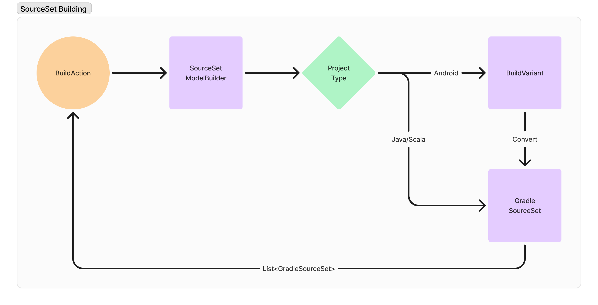
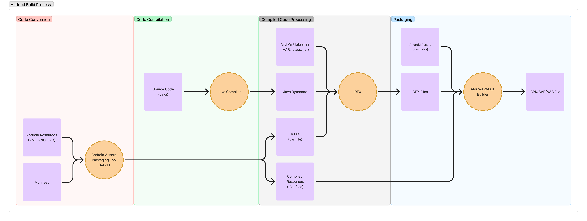

# ANDROID SUPPORT

Gradle Build Server provides initial support for Android projects with https://github.com/microsoft/build-server-for-gradle/pull/173

## Supported Features

- Languages: `Java`
- Project Types: `Application`, `Library`
- AGP Versions: [To be determined]

## Under the Hood: How it works?

We've leveraged the existing Java project support in Gradle Build Server and integrated it with Android development. We translate Android build variants (e.g., release, debug) into the Build Server Protocol's [build targets](https://build-server-protocol.github.io/docs/specification#buildtarget). We utilize the GradleSourceSet model, already used for Java projects, to store and manage Android build variant information. Here's a breakdown of the magic behind the scenes:

### 1. Project Detection:

Gradle Build Server detects if the Android plugin is applied to the project. It then uses the appropriate model builders to handle both Java and Android specifics.

### 2. Extracting Information:

We leverage reflection to gather necessary details about the project, such as compile tasks and dependencies. All the extracted data is used to build a `GradleSourceSet` model.

- We map Android variant's `assemble` task to the java sourceset's `classes` task, which ensures all resources and source code are compiled and packaged. This assemble task name follows the format `assemble<variant_name>`. E.g. `assembleRelease` for `release` variant and `assembleDebug` for `debug` variant.
- Java compile task responsible for compiling all the java code for the build variant follows a similar task name format `process<variant_name>JavaWithJavac`. E.g. `processReleaseJavaWithJavac` for `release` variant and `processDebugJavaWithJavac` for `debug` variant.
- Similar to Java projects, the `AndroidDependencyCollector` class handles module dependencies, including R files and Android SDK components.
- A build variant can have multiple source sets and each source set has java directories. We collect the list of these java directories which serve as the source directories.
- For the resource directories we take a similar approach of collecting the res and resource directories of the build variant's source sets.
- `processJavaResources` and `mergeResources` task provide the output directories of java and android resources.
- Using `javaCompile` task we fetch destination directory, compiler source directories and compiler args where the destination directory is used as `sourceOutputDirs`. Next we remove all the source directories from the compiler source directories to get the `generatedSourceDirs`.
- Classpath files for the variant is retrieved from the `compileConfiguration`.
- To determine if the variant has tests we check if android or unit tests are present in the given variant.
- Finally, we create the java extension using the compiler args we fetched earlier.

This integration allows Gradle Build Server to handle your Android projects just like any other Java or Scala project, ensuring a familiar and efficient workflow.

> [!NOTE]
> This is an ongoing effort, and future updates will expand Android support.

## Android Build Process: Relevant Part

The following diagram showcasing Android build process has been abstracted down to only show the parts which is relevant to this project's implementation.

## Known Limitations

### 1. Partial Intermediate Resources Support

Android generates a lot of intermediate sources such as AIDL, Render script, C/CPP, etc. Unfortunately AGP doesn't provide any APIs to retrieve these files. R file is one of these intermediate sources which is crucial for Android development so as a workaround we have retrieved the file using the process task for the build variant however, in some cases the task may not be registered during the sync in which case the dependency for R file is not provided.

**Issue:** https://github.com/microsoft/build-server-for-gradle/issues/181

### 2. Application and Library project Support

There are various kinds of projects that come under Android development such as `Application`, `Library`, `Instant App`, `Dynamic Modules`, `Android Test`, etc. We have added support for the most commonly used projects - `Application` and `Library` but the current implementation may require further enhancements to support other kinds of projects.

**Issue:** https://github.com/microsoft/build-server-for-gradle/issues/182

### 3. Test variants absent

Current implementation takes into account any user defined build variants and the default build variants - `debug` and `release` except the default test variants - test and androidTest. Test variants are different from the normal build variants and retrieving information from those requires further configurations.

**Issue:** https://github.com/microsoft/build-server-for-gradle/issues/183

### 4. No `ANDROID_HOME` fallback logic

Android Components to be used by an Android project is configured via `ANDROID_HOME` environment variable. If the property doesn't exist then we are not providing the dependency. This implementation can be improved via fallback logic similar to what we have for `JAVA_HOME` with https://github.com/microsoft/build-server-for-gradle/pull/165.

**Issue:** https://github.com/microsoft/build-server-for-gradle/issues/184

## Future Enhancements

- Support for more AGP versions

## Troubleshooting

If you face any issues with Android project support, please open a discussion for us to help. In case you find a bug in Android project support, please open an issue including the following information:

- Steps to reproduce
- Expected behaviour
- Actual behaviour
- Environment:
    - Operating System
    - BSP version
    - AGP version
- Android project repository
- Error messages or logs

You can also request features by opening an issue.