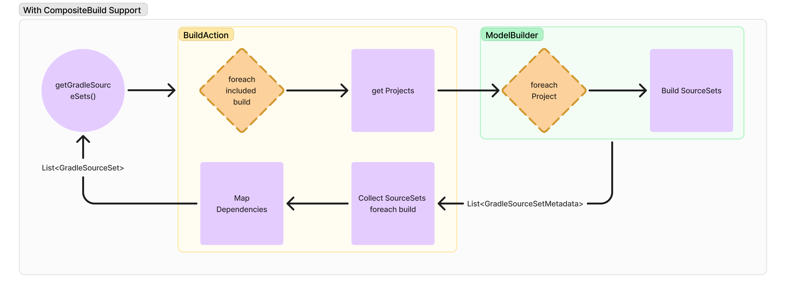
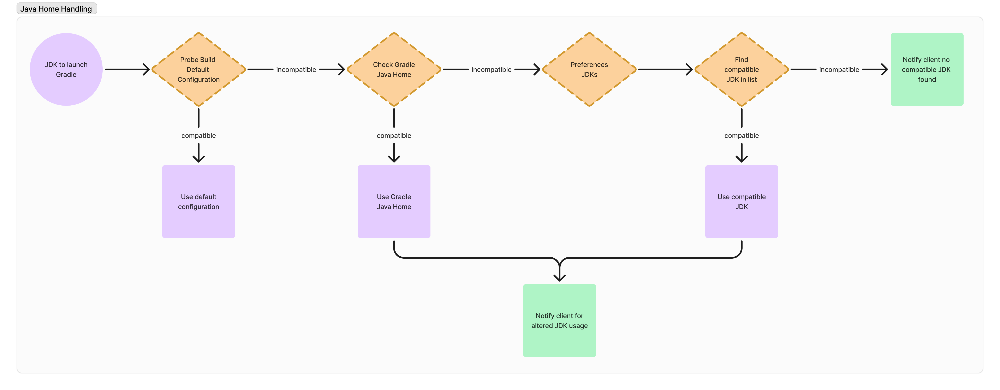

# Developer Documentation

This documentation will assist developers trying to understand the working of the Gradle Build Server for easier contribution or integration.

## Composite Builds

### Challenge

When using a model builder to fetch the GradleSourceSet model, the complete hierarchical scope of the project is lost. This hinders the ability to fetch included builds and project dependencies, which is crucial for composite builds.

### Our Solution: Using Build Actions

To address this limitation we take the following approach:

1. We utilize the `BuildAction` to capture the complete hierarchical scope of the project, allowing us to retrieve all the included builds and their associated information.
2. After obtaining the included builds, we use the model builder to get source sets for each individual project.
3. With te complete set of source sets for each included build we map the build target dependencies and return the list of `GradleSourceSets`.

## Java Home Handling

The default `JAVA_HOME` configuration of a project maybe incompatible with Gradle Build Server. If this happens we implemented a fallback logic to find a compatible JDK to launch the Gradle Build Server.

1. We probe build the project and look for any `JAVA_HOME` incompatibility error.
    - We probe build the project with `GradleBuild` model and check for a particular error message if a GradleException is thrown: `Could not create an instance of Tooling API implementation using the specified Gradle distribution` for incompatibility check.
    - If the default configuration is incompatible we move to the next step.
2. We get the Gradle Java Home and check if it is compatible.
    - If it is compatible then we use it and notify the client about the changed JDK usage.
    - If it is incompatible we move to the next step.
3. We finally traverse through the list of JDKs retrieved from the preferences, and try to find a compatible `JAVA_HOME`.
    - If a compatible JDK is found we use it and notify the client about the changed JDK usage.
    - If we fail to find a compatible JDK we notify the client that we could not find a compatible `JAVA_HOME` to launch the Gradle Build Server.

## Android Support

See [docs/android/README.md](./android/README.md)